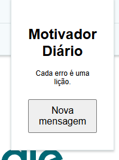

# Motivador Diário

Uma extensão para Google Chrome que exibe mensagens motivacionais no popup, ajudando você a se manter inspirado durante o uso do navegador.

***

## ✨ O que a extensão faz?
- Mostra uma mensagem motivacional aleatória toda vez que você clica no botão "Nova mensagem" no popup da extensão.
- Não coleta dados e não precisa de backend.

***

## 🚀 Instalação

1. Baixe ou clone este repositório:
   ```bash
   git clone https://github.com/mrpandaxy/bootcamp2-chrome-ext-mrpandaxy.git
   ```
   Ou baixe o ZIP da [release mais recente](https://github.com/mrpandaxy/bootcamp2-chrome-ext-mrpandaxy/releases/tag/v1.0.0).

2. Abra o Chrome e acesse:
   ```
   chrome://extensions
   ```

3. Ative o Modo do desenvolvedor (canto superior direito).

4. Clique em "Carregar sem compactação" e selecione a pasta do projeto (onde está o arquivo `manifest.json`).

5. O ícone da extensão aparecerá ao lado da barra de endereços. Clique nele para abrir o popup e usar!

***

## 🛠️ Como usar
- Clique no ícone da extensão para abrir o popup.
- Clique no botão "Nova mensagem" para ver uma mensagem motivacional diferente.

***

## 🗂️ Estrutura do Projeto
```
bootcamp2-chrome-ext-mrpandaxy/
├─ docs/
│  └─ index.html
├─ src/
│  ├─ popup/
│  │  ├─ popup.html
│  │  ├─ popup.js
│  │  └─ popup.css
│  ├─ background/
│  │  └─ service-worker.js
├─ icons/
│  ├─ icon16.png
│  ├─ icon32.png
│  ├─ icon48.png
│  └─ icon128.png
├─ manifest.json
├─ README.md
├─ LICENSE
```

***

## 📷 Exemplo de uso


```


```

***

## 🔒 Permissões
- `storage`: usada apenas para possíveis expansões futuras. Nenhum dado pessoal é coletado.

***

## 📄 Licença
Este projeto está licenciado sob a licença MIT. Veja o arquivo [LICENSE](./LICENSE) para mais detalhes.

***

## 🌐 Landing Page
Acesse a página de apresentação da extensão:
[https://mrpandaxy.github.io/bootcamp2-chrome-ext-mrpandaxy/](https://mrpandaxy.github.io/bootcamp2-chrome-ext-mrpandaxy/)

***

## 📦 Download da Release
Baixe a versão mais recente da extensão:
[https://github.com/mrpandaxy/bootcamp2-chrome-ext-mrpandaxy/releases/tag/v1.0.0](https://github.com/mrpandaxy/bootcamp2-chrome-ext-mrpandaxy/releases/tag/v1.0.0)

[1](https://ieeexplore.ieee.org/document/10928130/)
[2](https://online-journals.org/index.php/i-jim/article/view/45725)
[3](https://ieeexplore.ieee.org/document/10265943/)
[4](https://onlinelibrary.wiley.com/doi/10.1002/sec.1433)
[5](https://www.semanticscholar.org/paper/425c821e64176fcc80df8e0c76d04db1719c7fc0)
[6](https://ieeexplore.ieee.org/document/8812028/)
[7](https://doi.curvenote.com/10.25080/shinma-7f4c6e7-009)
[8](https://www.semanticscholar.org/paper/4fe890428ee5b383efdccc77fba670130f1280d3)
[9](https://arxiv.org/pdf/2312.03250.pdf)
[10](https://onlinelibrary.wiley.com/doi/pdfdirect/10.1029/2021EA001797)
[11](https://arxiv.org/html/2502.18440v1)
[12](https://arxiv.org/html/2407.21621v1)