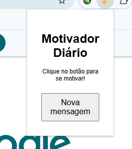
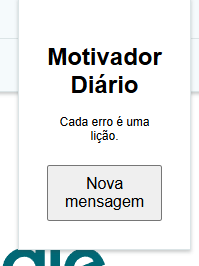

# Motivador Diário

Uma extensão simples para Google Chrome que exibe mensagens motivacionais no popup, ajudando você a se manter inspirado durante o uso do navegador.

***

## ✨ O que a extensão faz?
- Mostra uma mensagem motivacional aleatória toda vez que você clica no botão "Nova mensagem" no popup da extensão.
- Não coleta dados e não precisa de backend.

***

## 🚀 Instalação

1. **Baixe ou clone este repositório:**
   ```bash
   git clone https://github.com/mrpandaxy/bootcamp2-chrome-ext-mrpandaxy.git
   ```
   Ou baixe o ZIP e extraia.

2. **Abra o Chrome e acesse:**
   ```
   chrome://extensions
   ```

3. **Ative o Modo do desenvolvedor** (canto superior direito).

4. **Clique em "Carregar sem compactação"** e selecione a pasta do projeto (onde está o arquivo `manifest.json`).

5. O ícone da extensão aparecerá ao lado da barra de endereços. Clique nele para abrir o popup e usar!

***

## 🛠️ Como usar
- Clique no ícone da extensão para abrir o popup.
- Clique no botão "Nova mensagem" para ver uma mensagem motivacional diferente.

***

## 🗂️ Estrutura do Projeto
```
my-chrome-extension/
├─ src/
│  ├─ popup/
│  │  ├─ popup.html
│  │  ├─ popup.js
│  │  └─ popup.css
│  ├─ background/
│  │  └─ service-worker.js
├─ icons/
│  ├─ icon16.png
│  ├─ icon32.png
│  ├─ icon48.png
│  └─ icon128.png
├─ docs/
│  └─ index.html
├─ manifest.json
├─ README.md
└─ LICENSE
```

***

## 🔒 Permissões
- `storage`: usada apenas para possíveis expansões futuras. Nenhum dado pessoal é coletado.

***

## 📄 Licença
Este projeto está licenciado sob a licença MIT. Veja o arquivo LICENSE para mais detalhes.

***

## 🙋‍♂️ Contribuição
Pull requests são bem-vindos! Para grandes mudanças, abra uma issue primeiro para discutir o que você gostaria de modificar.

***

## 📷 Screenshots


[1](https://www.ndss-symposium.org/wp-content/uploads/2019/02/ndss2019_01B-4_Schwarz_paper.pdf)
[2](https://onlinelibrary.wiley.com/doi/10.1002/sec.1433)
[3](https://www.semanticscholar.org/paper/85164fc82cbefa647bd1502dbf0e771092290cfd)
[4](https://www.semanticscholar.org/paper/425c821e64176fcc80df8e0c76d04db1719c7fc0)
[5](https://www.semanticscholar.org/paper/4bd60b6f054d5de051b5b136214c2b3be6fc1328)
[6](https://www.semanticscholar.org/paper/f3bb73021829ca540c7eb237aa5e4e95ba544d6e)
[7](https://www.semanticscholar.org/paper/14af0ec9aeba95d9e10b9fb2b3b2b1bbccbc8d94)
[8](http://link.springer.com/10.1007/BF00741633)
[9](https://ieeexplore.ieee.org/document/8812028/)
[10](https://nv.nltu.edu.ua/index.php/journal/article/view/2088)
[11](https://arxiv.org/html/2407.21621v1)
[12](https://arxiv.org/pdf/2311.18057.pdf)
[13](https://arxiv.org/pdf/2312.03250.pdf)
[14](http://arxiv.org/pdf/1802.08391.pdf)
[15](http://arxiv.org/pdf/2412.00726.pdf)
[16](https://pmc.ncbi.nlm.nih.gov/articles/PMC5018380/)